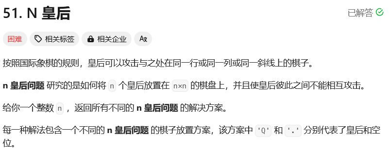
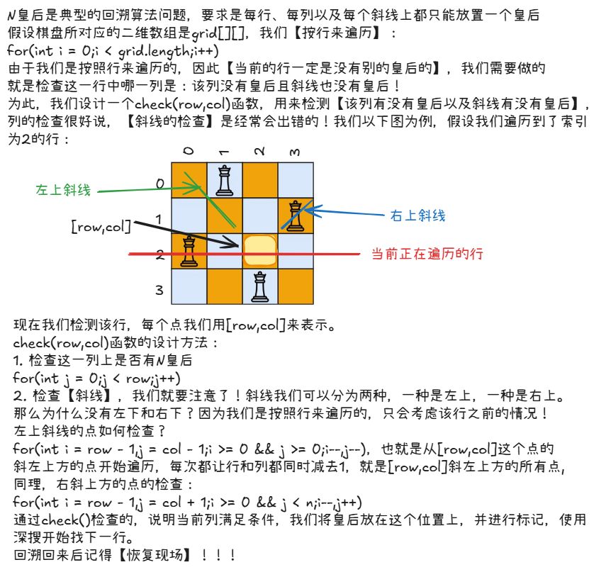

# leetcode-N皇后

### 题干


### 思路方法


### 代码实现

```java title="Java Code" showLineNumbers
class Solution {
    // 答案列表
    List<List<String>> ans;
    // 记录棋盘的形状为n * n
    int n;
    // 记录棋盘每个位置的数据
    char[][] g;
    public List<List<String>> solveNQueens(int n) {
        // 初始化
        this.n = n;
        ans = new ArrayList<>();
        g = new char[n][n];

        // 初始化棋盘,'.'表示该位置没有放棋子
        for(int i = 0;i < n;i++){
            for(int j = 0;j < n;j++){
                g[i][j] = '.';
            }
        }

        dfs(0);

        return ans;
    }

    // 按行进行遍历，因此传递的是row，当row == n时，意味着所有的行都以遍历完毕，向ans中添加答案
    public void dfs(int row){
        if(row == n){
            List<String> inner = new ArrayList<>();

            for(int i = 0;i < n;i++){
                StringBuilder sb = new StringBuilder("");
                for(int j = 0;j < n;j++){
                    sb.append(g[i][j]);
                }
                inner.add(sb.toString());
            }

            ans.add(inner);
        }

        // 遍历这一行的所有位置，如果当前的[row,i]位置通过了check函数的检查，
        // 说明目前来看可以放，于是记录现场 + 下一层搜索
        for(int i = 0;i < n;i++){
            if(check(row,i)){
                g[row][i] = 'Q';
                dfs(row + 1);
                // 恢复现场
                g[row][i] = '.';
            }
        }
    }
    
    // 检查放在[row,col]这个位置合不合理
    // 1. 检查同一列
    // 2. 检查斜向方向，分别是左斜角和右斜角
    // 3. 不需要检查行，因为我们是按照行来遍历的，同行肯定是没有相同元素的
    public boolean check(int row,int col){
        for(int i = 0;i < n;i++){
            if(g[i][col] == 'Q') return false;
        }

        for(int i = row - 1,j = col - 1;i >= 0 && j >= 0;i--,j--){
            if(g[i][j] == 'Q') return false;
        }

        for(int i = row - 1,j = col + 1;i >= 0 && j < n;i--,j++){
            if(g[i][j] == 'Q') return false;
        }

        return true;
    }
}
```

### 参考资料
:link:[leetcode-N皇后](https://www.bilibili.com/video/BV1Rd4y1c7Bq?spm_id_from=333.788.videopod.sections&vd_source=6ede335d4055bf3e9252d271f861c6e6)