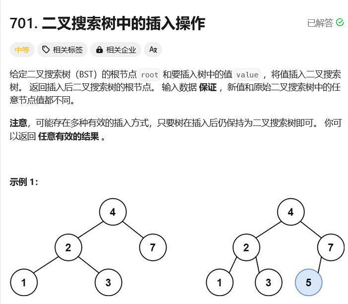

# leetcode-二叉搜索树中的插入操作

### 题干



### 代码实现

```java title="Java Code" showLineNumbers
/**
 * Definition for a binary tree node.
 * public class TreeNode {
 *     int val;
 *     TreeNode left;
 *     TreeNode right;
 *     TreeNode() {}
 *     TreeNode(int val) { this.val = val; }
 *     TreeNode(int val, TreeNode left, TreeNode right) {
 *         this.val = val;
 *         this.left = left;
 *         this.right = right;
 *     }
 * }
 */
class Solution {
    public TreeNode insertIntoBST(TreeNode root, int val) {
        return dfs(root,val);
    }

    public TreeNode dfs(TreeNode root, int val){
        if(root == null) {
            TreeNode node = new TreeNode(val);
            return node;
        }

        if(val < root.val){
            root.left = dfs(root.left,val);
        }
        if(val > root.val){
            root.right = dfs(root.right, val);
        }

        return root;
    }
}
```