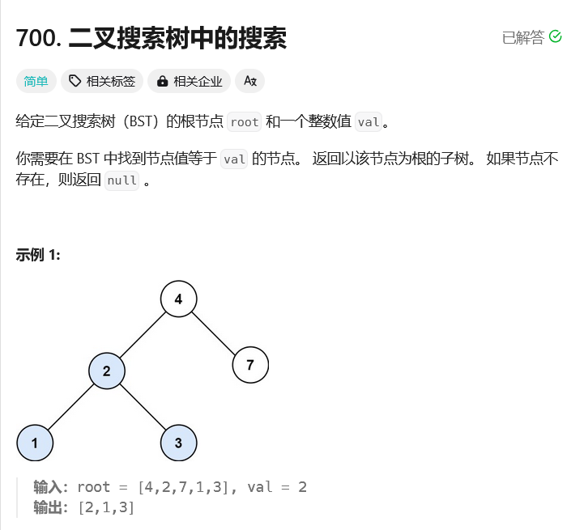

# leetcode-二叉搜索树中的搜索

### 题干


### 代码实现

```java title="Java Code" showLineNumbers
/**
 * Definition for a binary tree node.
 * public class TreeNode {
 *     int val;
 *     TreeNode left;
 *     TreeNode right;
 *     TreeNode() {}
 *     TreeNode(int val) { this.val = val; }
 *     TreeNode(int val, TreeNode left, TreeNode right) {
 *         this.val = val;
 *         this.left = left;
 *         this.right = right;
 *     }
 * }
 */
class Solution {
    boolean flag;
    TreeNode ans;
    public TreeNode searchBST(TreeNode root, int val) {
        dfs(root,val);
        return ans;
    }

    public void dfs(TreeNode root, int val){
        if(root == null) return;

        if(flag == true) return;

        if(root.val == val){
            ans = root;
            flag = true;
            return;
        }

        if(root.val > val){
            dfs(root.left,val);
        }else{
            dfs(root.right,val);
        }
    }
}
```