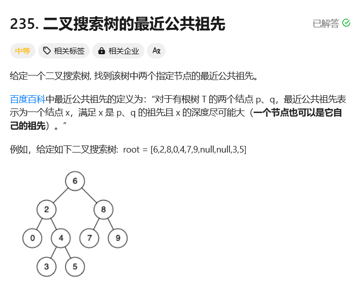
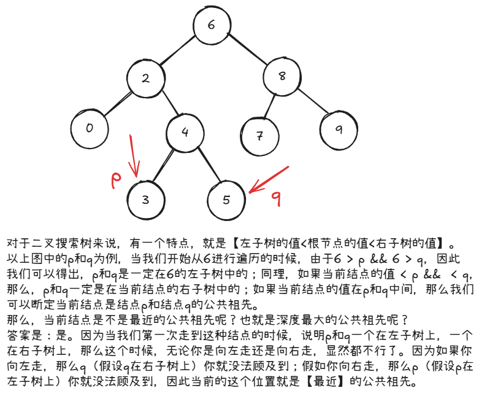

# leetcode-二叉搜索树的最近公共祖先

### 题干


### 思路方法


### 代码实现
```java title="Java Code" showLineNumbers
/**
 * Definition for a binary tree node.
 * public class TreeNode {
 *     int val;
 *     TreeNode left;
 *     TreeNode right;
 *     TreeNode(int x) { val = x; }
 * }
 */
class Solution {
    TreeNode res = null;
    public TreeNode lowestCommonAncestor(TreeNode root, TreeNode p, TreeNode q) {
        dfs(root,p,q);
        return res;
    }

    public void dfs(TreeNode root,TreeNode p,TreeNode q){
        if(res != null) return;

        if(root == null) return;

        if(root.val > p.val && root.val > q.val) dfs(root.left,p,q);
        else if(root.val < p.val && root.val < q.val) dfs(root.right,p,q);
        else{
            res = root;
        }
    }
}
```