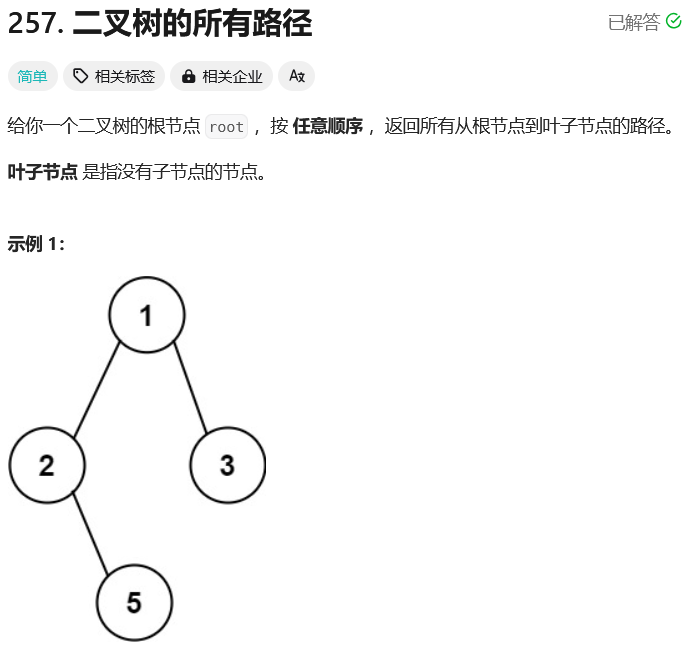
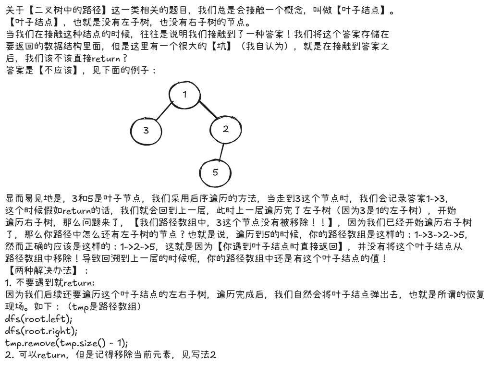

# leetcode-二叉树的所有路径

### 题干


### 思路方法


### 代码实现

#### 写法1

```java title="Java Code" showLineNumbers {38,39}
/**
 * Definition for a binary tree node.
 * public class TreeNode {
 *     int val;
 *     TreeNode left;
 *     TreeNode right;
 *     TreeNode() {}
 *     TreeNode(int val) { this.val = val; }
 *     TreeNode(int val, TreeNode left, TreeNode right) {
 *         this.val = val;
 *         this.left = left;
 *         this.right = right;
 *     }
 * }
 */
class Solution {
    List<Integer> tmp;
    List<String> ans;
    public List<String> binaryTreePaths(TreeNode root) {
        tmp = new ArrayList<>();
        ans = new ArrayList<>();
        dfs(root);
        return ans;
    }

    public void dfs(TreeNode root){
        if(root == null) return;

        tmp.add(root.val);
        if(root.left == null && root.right == null){
            StringBuilder str = new StringBuilder("");
            for(Integer inner : tmp){
                str.append(inner + "->");
            }
            str.deleteCharAt(str.length() - 1);
            str.deleteCharAt(str.length() - 1);
            ans.add(str.toString());
            // 这里千万不要return !!!
            // return;
        }

        dfs(root.left);
        dfs(root.right);
        tmp.remove(tmp.size() - 1);
    }
}
```

#### 写法2

```java title="Java Code" showLineNumbers {38,39,44,45,46}
/**
 * Definition for a binary tree node.
 * public class TreeNode {
 *     int val;
 *     TreeNode left;
 *     TreeNode right;
 *     TreeNode() {}
 *     TreeNode(int val) { this.val = val; }
 *     TreeNode(int val, TreeNode left, TreeNode right) {
 *         this.val = val;
 *         this.left = left;
 *         this.right = right;
 *     }
 * }
 */
class Solution {
    List<Integer> tmp;
    List<String> ans;
    public List<String> binaryTreePaths(TreeNode root) {
        tmp = new ArrayList<>();
        ans = new ArrayList<>();
        dfs(root);
        return ans;
    }

    public void dfs(TreeNode root){
        if(root == null) return;

        tmp.add(root.val);
        if(root.left == null && root.right == null){
            StringBuilder str = new StringBuilder("");
            for(Integer inner : tmp){
                str.append(inner + "->");
            }
            str.deleteCharAt(str.length() - 1);
            str.deleteCharAt(str.length() - 1);
            ans.add(str.toString());
            tmp.remove(tmp.size() - 1);
            return;
        }

        dfs(root.left);
        dfs(root.right);
        // 这里不可以移除掉
        // 因为我们在回溯的时候，非叶子的节点的移除还要依赖这里
        tmp.remove(tmp.size() - 1);
    }
}
```