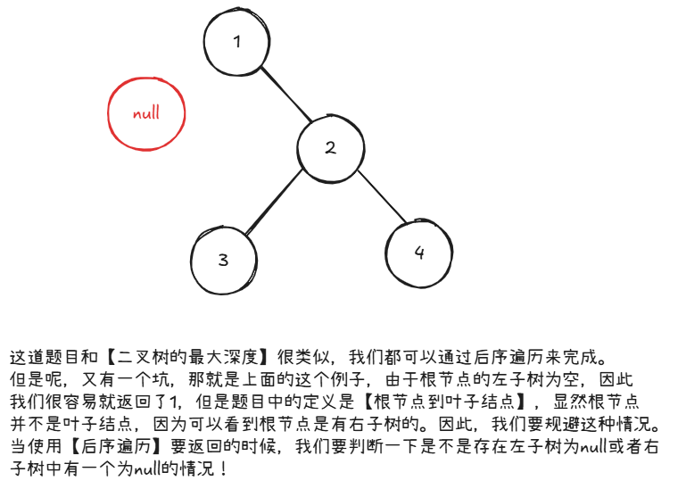

# leetcode-二叉树的最小深度

### 题干


### 思路方法


### 代码实现
```java title="Java Code" showLineNumbers {27,28,29,30}
/**
 * Definition for a binary tree node.
 * public class TreeNode {
 *     int val;
 *     TreeNode left;
 *     TreeNode right;
 *     TreeNode() {}
 *     TreeNode(int val) { this.val = val; }
 *     TreeNode(int val, TreeNode left, TreeNode right) {
 *         this.val = val;
 *         this.left = left;
 *         this.right = right;
 *     }
 * }
 */
class Solution {
    int ans = Integer.MAX_VALUE;
    public int minDepth(TreeNode root) {
        return dfs(root);
    }

    public int dfs(TreeNode root){
        if(root == null) return 0;
        int left_dep = dfs(root.left);
        int right_dep = dfs(root.right);

        // 注意这里的判定！！
        if(root.left == null && root.right != null) return right_dep + 1;
        else if(root.left != null && root.right == null) return left_dep + 1;
        else return Math.min(left_dep,right_dep) + 1;
    }
}
```