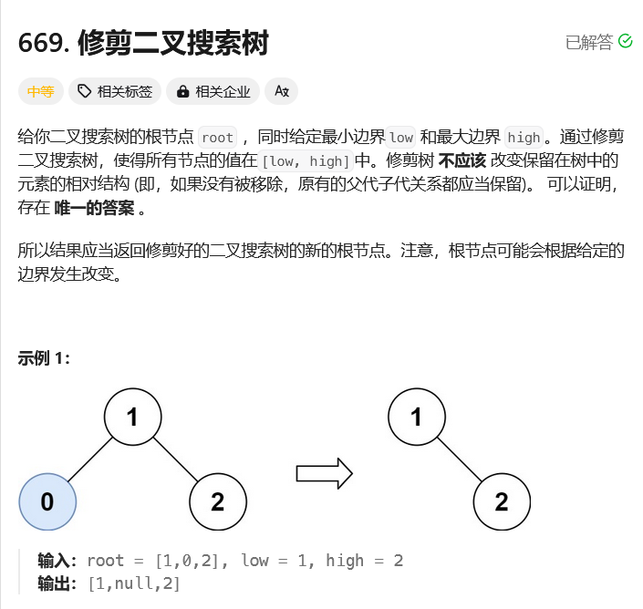

# leetcode-修剪二叉搜索树

### 题干


### 代码实现
```java title="Java Code" showLineNumbers
/**
 * Definition for a binary tree node.
 * public class TreeNode {
 *     int val;
 *     TreeNode left;
 *     TreeNode right;
 *     TreeNode() {}
 *     TreeNode(int val) { this.val = val; }
 *     TreeNode(int val, TreeNode left, TreeNode right) {
 *         this.val = val;
 *         this.left = left;
 *         this.right = right;
 *     }
 * }
 */
class Solution {
    public TreeNode trimBST(TreeNode root, int low, int high) {
        return dfs(root,low,high);
    }

    public TreeNode dfs(TreeNode root,int low,int high){
        if(root == null) return null;
        if(root.val < low){
            return dfs(root.right,low,high);
        }
        if(root.val > high){
            return dfs(root.left,low,high);
        }

        root.left = dfs(root.left,low,high);
        root.right = dfs(root.right,low,high);

        return root;
    }
}
```