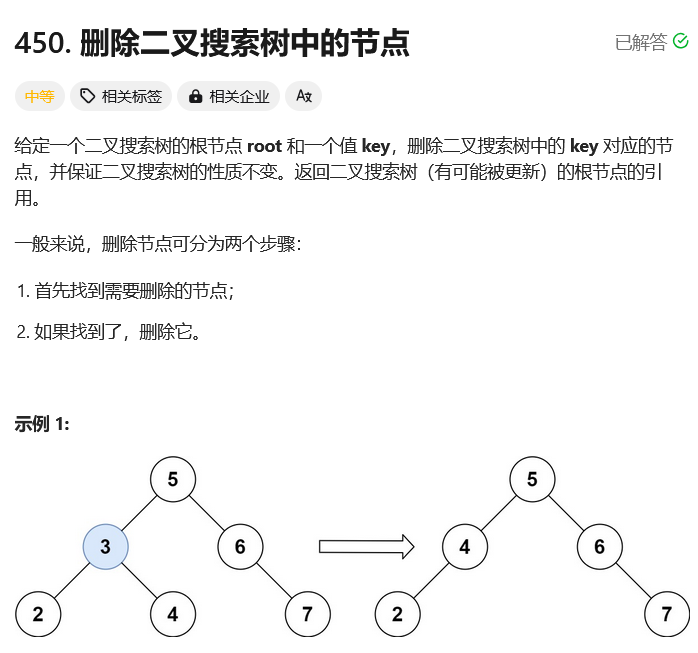

# leetcode-删除二叉搜索树中的节点

### 题干


### 代码实现

```java title="Java Code" showLineNumbers {22,23,24,25,26,27,28,29,30,31,32,33,34}
/**
 * Definition for a binary tree node.
 * public class TreeNode {
 *     int val;
 *     TreeNode left;
 *     TreeNode right;
 *     TreeNode() {}
 *     TreeNode(int val) { this.val = val; }
 *     TreeNode(int val, TreeNode left, TreeNode right) {
 *         this.val = val;
 *         this.left = left;
 *         this.right = right;
 *     }
 * }
 */
class Solution {
    public TreeNode deleteNode(TreeNode root, int key) {
        return dfs(root,key);
    }

    public TreeNode dfs(TreeNode root,int key){
        if(root == null) return null;
        if(root.val == key){
            if(root.left == null && root.right == null) return null;
            if(root.left != null && root.right == null) return root.left;
            if(root.left == null && root.right != null) return root.right;
            if(root.left != null && root.right != null){
                TreeNode cur = root.right;
                while(cur.left != null) cur = cur.left;
                cur.left = root.left;
                root.left = null;
                return root.right;
            }
        }

        if(key > root.val) root.right = dfs(root.right,key);
        if(key < root.val) root.left = dfs(root.left,key);
        return root;
    }
}
```