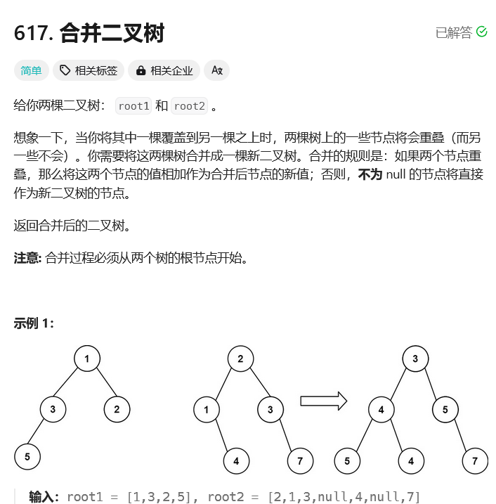

# leetcode-合并二叉树

### 题干


### 代码实现

```java title="Java Code" showLineNumbers {18,19,20,21,22,23}
/**
 * Definition for a binary tree node.
 * public class TreeNode {
 *     int val;
 *     TreeNode left;
 *     TreeNode right;
 *     TreeNode() {}
 *     TreeNode(int val) { this.val = val; }
 *     TreeNode(int val, TreeNode left, TreeNode right) {
 *         this.val = val;
 *         this.left = left;
 *         this.right = right;
 *     }
 * }
 */
class Solution {
    public TreeNode mergeTrees(TreeNode t1, TreeNode t2) {
        if (t1 == null) {
            return t2;
        }
        if (t2 == null) {
            return t1;
        }
        TreeNode merged = new TreeNode(t1.val + t2.val);
        merged.left = mergeTrees(t1.left, t2.left);
        merged.right = mergeTrees(t1.right, t2.right);
        return merged;
    }
}
```