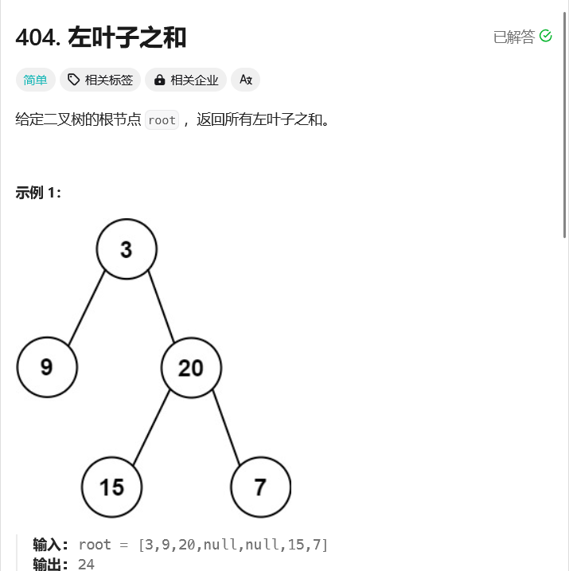
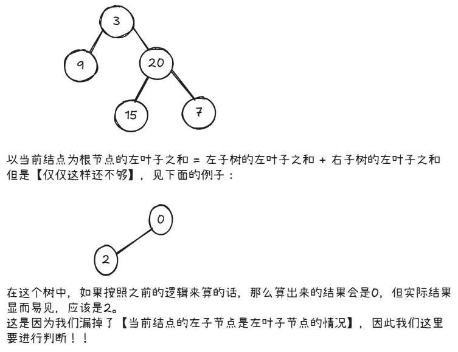

# leetcode-左叶子之和

### 题干


### 思路方法



### 代码实现
```java title="Java Code" showLineNumbers {27,28,29,30}
/**
 * Definition for a binary tree node.
 * public class TreeNode {
 *     int val;
 *     TreeNode left;
 *     TreeNode right;
 *     TreeNode() {}
 *     TreeNode(int val) { this.val = val; }
 *     TreeNode(int val, TreeNode left, TreeNode right) {
 *         this.val = val;
 *         this.left = left;
 *         this.right = right;
 *     }
 * }
 */
class Solution {
    public int sumOfLeftLeaves(TreeNode root) {
        return dfs(root);
    }

    public int dfs(TreeNode root){
        if(root == null) return 0;

        int left_num = dfs(root.left);
        int right_num = dfs(root.right);
        int mid_num = 0;
        // 要记得判断当前结点的左子节点是左叶子结点的情况！！
        if(root.left != null && root.left.left == null && root.left.right == null){
            mid_num = root.left.val;
        }
        return left_num + right_num + mid_num;
    }
}
```