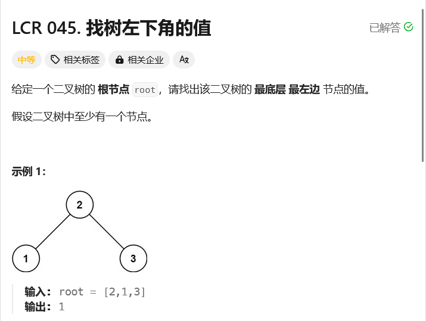

# leetcode-找树左下角的值

### 题干



### 代码实现

```java title="Java Code" showLineNumbers
/**
 * Definition for a binary tree node.
 * public class TreeNode {
 *     int val;
 *     TreeNode left;
 *     TreeNode right;
 *     TreeNode() {}
 *     TreeNode(int val) { this.val = val; }
 *     TreeNode(int val, TreeNode left, TreeNode right) {
 *         this.val = val;
 *         this.left = left;
 *         this.right = right;
 *     }
 * }
 */
class Solution {
    public int findBottomLeftValue(TreeNode root) {
        int idx = 0;
        int[] ans = new int[10000 + 10];

        Queue<TreeNode> q = new LinkedList<>();
        q.add(root);

        while(q.isEmpty() != true){
            int num = q.size();

            for(int i = 0;i < num;i++){
                TreeNode tmp = q.poll();
                if(i == 0) {
                    ans[idx] = tmp.val;
                    idx++;
                }
                if(tmp.left != null) q.add(tmp.left);
                if(tmp.right != null) q.add(tmp.right);
            }
        }

        return ans[idx - 1];
    }
}
```