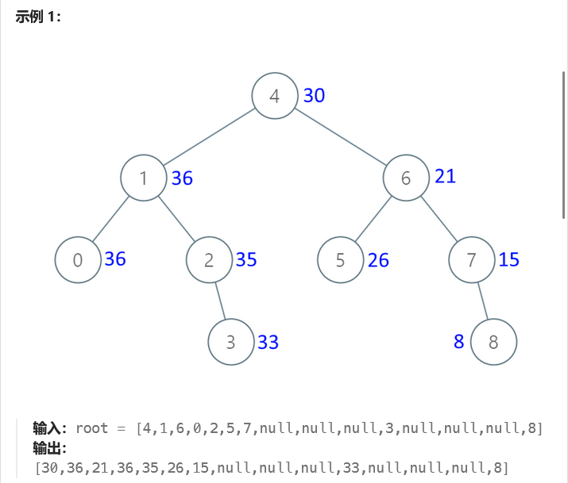
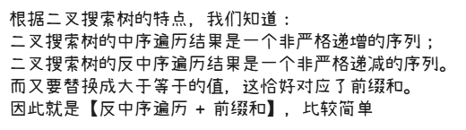

# leetcode-把二叉搜索树转换为累加树

### 题干




### 思路方法



### 代码实现

```java title="Java Code" showLineNumbers
/**
 * Definition for a binary tree node.
 * public class TreeNode {
 *     int val;
 *     TreeNode left;
 *     TreeNode right;
 *     TreeNode() {}
 *     TreeNode(int val) { this.val = val; }
 *     TreeNode(int val, TreeNode left, TreeNode right) {
 *         this.val = val;
 *         this.left = left;
 *         this.right = right;
 *     }
 * }
 */
class Solution {
    int preNum = 0;
    // 这个东西还是需要的，可以用来标识当前是不是中序遍历的开始
    TreeNode preNode = null;
    public TreeNode convertBST(TreeNode root) {
       dfs(root);
       return root;
    }

    public void dfs(TreeNode root){
        if(root == null) return;

        dfs(root.right);
        if(preNode == null){
            preNode = root;
            preNum += preNode.val;
        }else{
            root.val = preNum + root.val;
            preNum = root.val;
            preNode = root;
        }
        dfs(root.left);
    }
}
```