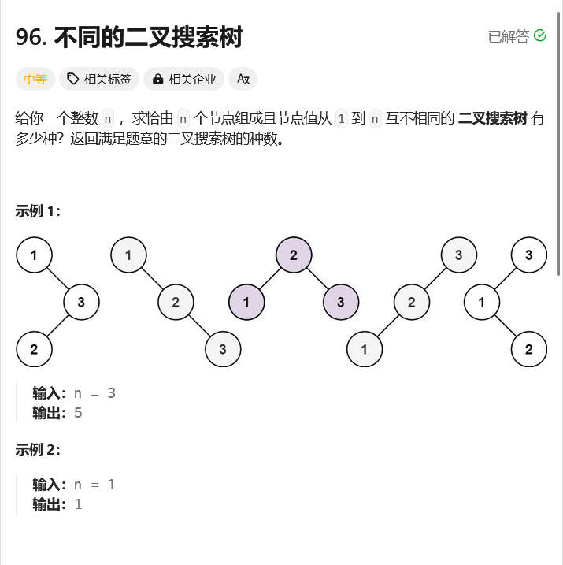

# leetcode-不同的二叉搜索树

### 题干



### 代码实现
```java title="Java Code" showLineNumbers
class Solution {
    public int numTrees(int n) {
        int[] dp = new int[n + 1];

        if(n == 0 || n == 1) return 1;

        dp[0] = 1;
        dp[1] = 1;

        for(int i = 2;i <= n;i++){
            for(int j = 1;j <= i;j++){
                dp[i] += dp[j - 1] * dp[i - j];
            }
        }

        return dp[n];
    }
}
```