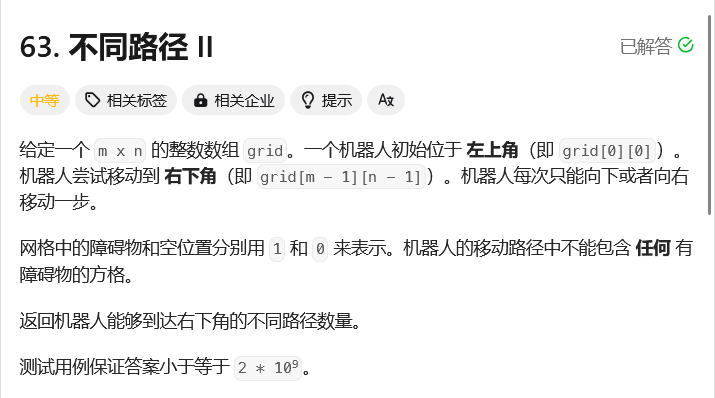
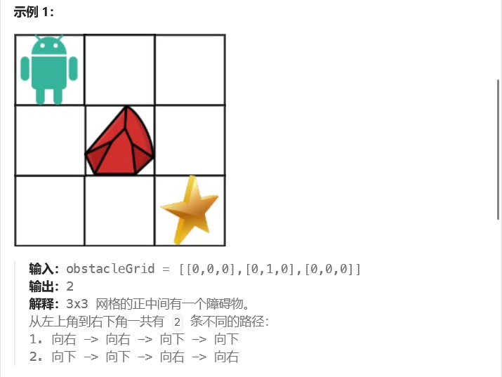

# leetcode-不同路径II

### 题干




### 代码实现

```java title="Java Code" showLineNumbers {7,8,9,10,24,25}
class Solution {
    public int uniquePathsWithObstacles(int[][] obstacleGrid) {
        int m = obstacleGrid.length;
        int n = obstacleGrid[0].length;
        int[][] dp = new int[obstacleGrid.length][obstacleGrid[0].length];

        // 如果开始或者终点已经是0的话，那么就没有进行下去的必要了！
        if (obstacleGrid[m - 1][n - 1] == 1 || obstacleGrid[0][0] == 1) {
            return 0;
        }

        for(int i = 0;i < dp[0].length;i++){
            if(obstacleGrid[0][i] == 1) break;
            dp[0][i] = 1;
        }

        for(int i = 0;i < dp.length;i++){
            if(obstacleGrid[i][0] == 1) break;
            dp[i][0] = 1;
        }

        for(int i = 1;i < dp.length;i++){
            for(int j = 1;j < dp[0].length;j++){
                // 在遍历的过程中，要注意判断当前的位置是不是障碍物位置，如果是障碍物位置，则设置为0！！！
                dp[i][j] = (obstacleGrid[i][j] == 0) ? dp[i - 1][j] + dp[i][j - 1] : 0;
            }
        }

        return dp[obstacleGrid.length - 1][obstacleGrid[0].length - 1];
    }
}
```