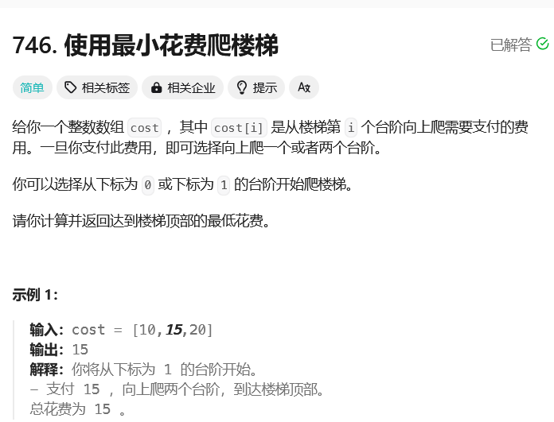

# leetcode-使用最小花费爬楼梯

### 题干



### 代码实现

```java title="Java Code" showLineNumbers {3,4,5}
class Solution {
    public int minCostClimbingStairs(int[] cost) {
        // 注意只能特判等于1的时候
        // 因为我们这个题目的终点是数组外的第一个位置！！
        if(cost.length == 1) return cost[0];
        
        int[] dp = new int[cost.length + 1];
        dp[0] = 0;
        dp[1] = 0;
        for(int i = 2;i <= cost.length;i++){
            dp[i] = Math.min(dp[i - 1] + cost[i - 1],dp[i - 2] + cost[i - 2]);
        }

        return dp[cost.length];
    }
}
```