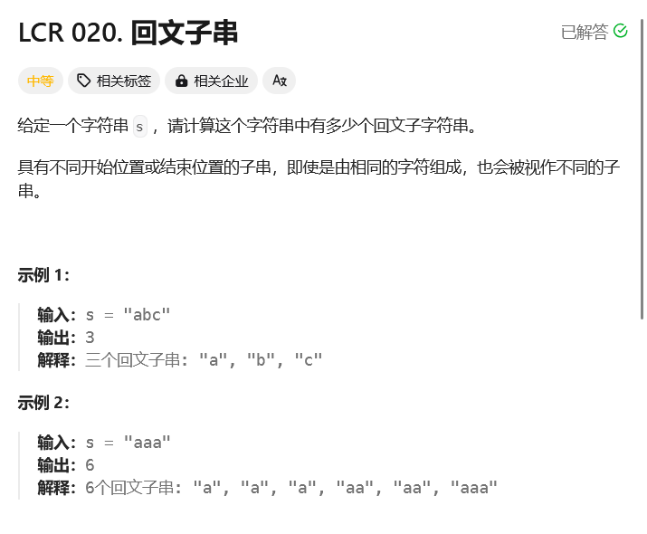

# leetcode-回文子串

### 题干



### 代码实现
```java title="Java Code" showLineNumbers
class Solution {
    public int countSubstrings(String s) {
        int ans = 0;
        boolean[][] dp = new boolean[s.length()][s.length()];

        for(int i = s.length() - 1;i >= 0;i--){
            for(int j = i;j <= s.length() - 1;j++){
                if(s.charAt(i) == s.charAt(j)){
                    if(j - i <= 1){
                        ans++;
                        dp[i][j] = true;
                    }else{
                        if(dp[i + 1][j - 1]){
                            ans++;
                            dp[i][j] = true;
                        }
                    }
                }
            }
        }

        return ans;
    }
}
```