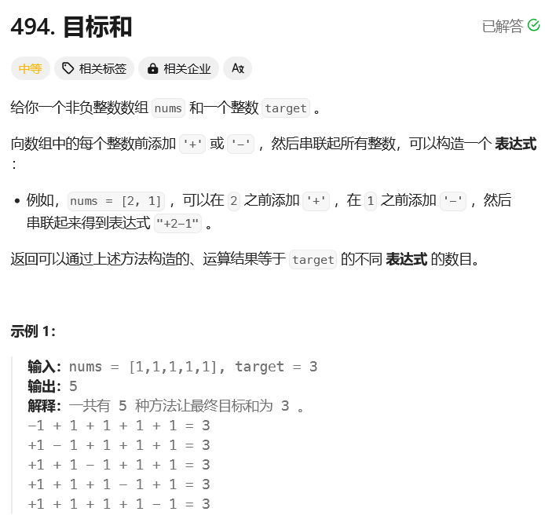

# leetcode-目标和

### 题干



### 代码实现
```java title="Java Code" showLineNumbers
class Solution {
    public int findTargetSumWays(int[] nums, int target) {
        int sum = 0;
        for(int num : nums) sum += num;

        // 如果target的绝对值比总和都要大，那么无论怎么划分，都是不可能存在答案的
        if(Math.abs(target) > sum) return 0;

        if((sum + target) % 2 == 1) return 0;

        // 这里得和后边的 + 1的地方分清楚！！！
        int[] dp = new int[(sum + target) / 2 + 1];
        dp[0] = 1;

        for(int i = 0;i < nums.length;i++){
            for(int j = (sum + target) / 2;j >= nums[i];j--){
                dp[j] += dp[j - nums[i]];
            }
        }

        return dp[(sum + target) / 2];
    }
}
```
