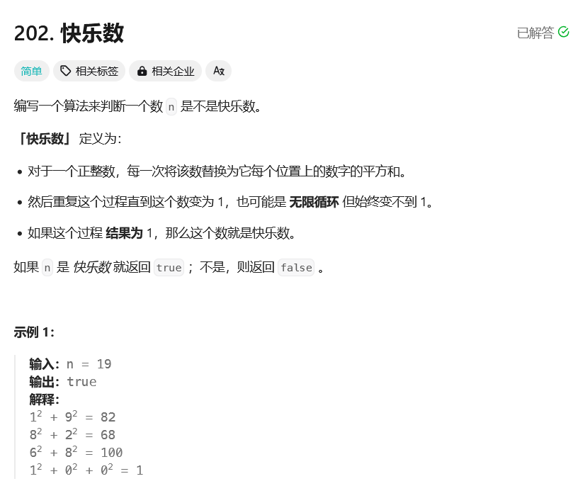
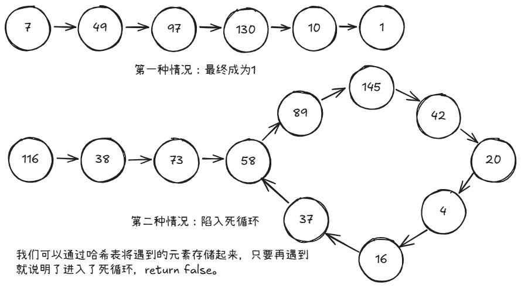

# leetcode-快乐数

### 题干


### 思路方法


### 代码实现
```java title="Java Code" showLineNumbers {6,7,8}
class Solution {
    public boolean isHappy(int n) {
        // 通过哈希表来记录是否有循环
        Map<Integer,Integer> mp = new HashMap<Integer,Integer>();

        while(n != 1){
            // 注意这里不要写成mp.put(1,1)！！
            if(mp.containsKey(n) == false){
                mp.put(n,1);
            }else{
                return false;
            }

            n = getNextNum(n);
        }

        return true;
    }

    public int getNextNum(int num){
        int ans = 0;

        while(num != 0){
            ans += (num % 10) * (num % 10);
            num = num / 10;
        }

        return ans;
    }
}
```