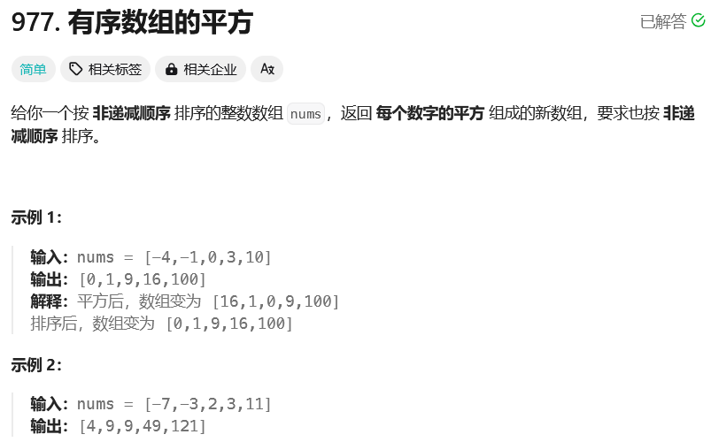
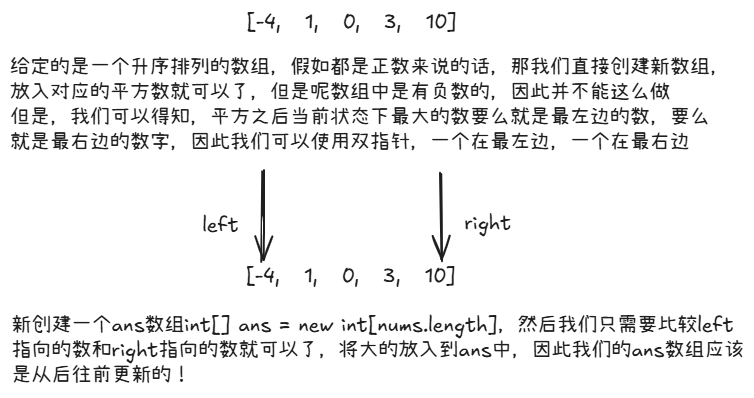

# leetcode-有序数组的平方

### 题干


### 思路方法


### 代码实现
```java title="Java Code" showLineNumbers {11,12}
class Solution {
    public int[] sortedSquares(int[] nums) {
        int[] ans = new int[nums.length];

        int l = 0;
        int r = nums.length - 1;

        // 记录新数组的当前处理到的索引
        int idx = r;

        // 注意这里得是l <= r，不能写成l < r，这样的话，我们没有办法更新l == r时候的那个值到ans数组中
        while(l <= r){

            if(nums[l] * nums[l] > nums[r] * nums[r]){
                ans[idx] = nums[l] * nums[l];
                idx--;
                l++;
            }else{
                ans[idx] = nums[r] * nums[r];
                idx--;
                r--;
            }
        }

        return ans;
    }
}
```