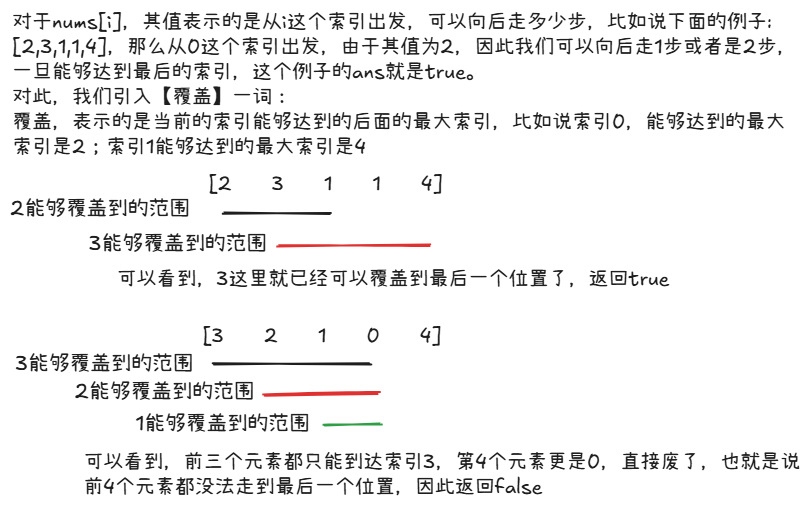

# leetcode-跳跃游戏

### 题干


### 思路方法



### 代码实现

```java title="Java Code" showLineNumbers {9}
class Solution {
    public boolean canJump(int[] nums) {
        // 能够到达的最大的下标
        int max_idx = 0;

        // 当前索引能够到达的最大的下标
        int cur_idx = 0;

        // 注意并不是i < nums.length，应该是当i走到最大的能够达到的下标，即max_idx
        // 期间如果max_idx >= nums.length - 1，说明最后是肯定可以走道的，直接return true就可以
        for(int i = 0;i <= max_idx;i++){

            cur_idx = i + nums[i];
            if(cur_idx > max_idx) max_idx = cur_idx;
            if(max_idx >= nums.length - 1) return true;
        }

        // 能走到这里，说明一定是达到不了终点了，return false即可
        return false;
    }
}
```

### 参考资料
:link:[leetcode-跳跃游戏](https://www.bilibili.com/video/BV1VG4y1X7kB?spm_id_from=333.788.videopod.sections&vd_source=6ede335d4055bf3e9252d271f861c6e6)