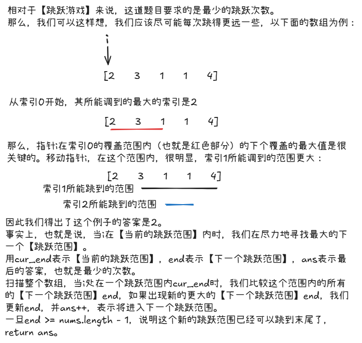

# leetcode-跳跃游戏II

### 题干


### 思路方法


### 代码实现
```java title="Java Code" showLineNumbers
class Solution {
    public int jump(int[] nums) {
        int ans = 0;

        // 如果长度只有1，那么不用跳跃就已经达到了末尾
        if(nums.length == 1) return 0;

        // 当前的跳跃范围
        int cur_end = 0;
        // 下一个跳跃范围
        int end = 0;

        // 遍历整个元素
        for(int i = 0; i < nums.length; i++){
        
            // 计算当前跳跃范围的当前索引下一跳能够跳到的最大索引
            int tmp_end = i + nums[i];

            // 更新当前跳跃范围的下一跳能够到达的最大索引
            cur_end = Math.max(tmp_end,cur_end);
            
            // 已经遍历到了当前跳跃范围的最后一个位置，那么更新下一个跳跃范围的值和最小次数
            // if(i == end) 为什么不需要cur_end > end呢？因为题目说了一定有解，
            // 也就是说，走到当前跳跃范围的最后一个位置时，cur_end一定是 >= end的
            // 如果可能存在无解的情况，就需要cur_end > end并且进行一定的判断了
            if(i == end){
                end = cur_end;
                ans++;
            }
            
            // 如果下一个跳跃范围的值已经达到了最后位置，则return
            if(end >= nums.length - 1) return ans;
        }

        return ans;
    }
}
```
