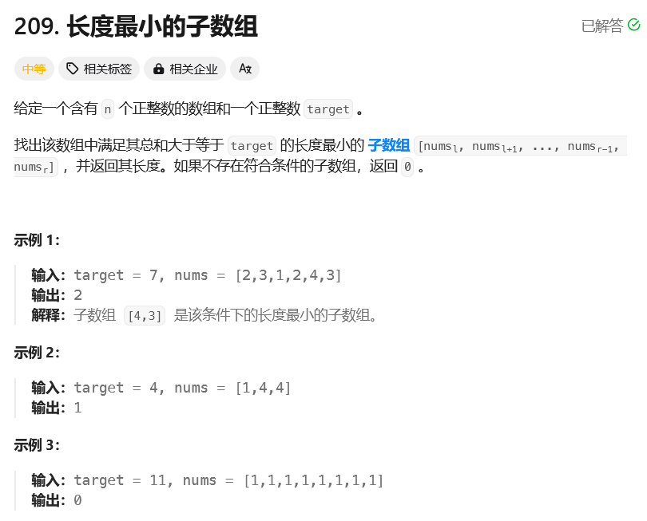

# leetcode-长度最小的子数组

### 题干


### 思路方法
1. 定义ans为Integer.MAX_VALUE，便于后续的比较
2. 定义sum，以及i和j
3. 通过双指针，移动j，当sum >= target时，开始搜索i，并和ans进行比较
4. 值得一提的是，这道题目是有可能无解的，因此将i初始化为-1，便于查看是否有解

### 代码实现
```java title="Java Code" showLineNumbers {7,8,9,10}
class Solution {
    public int minSubArrayLen(int target, int[] nums) {
        int ans = Integer.MAX_VALUE;

        int sum = 0;

        // 理论上来讲，让i = 0或者i = -1都是没有什么问题的
        // 但是题干中提到了可能存在没有解的情况
        // 因此我们可以通过i = -1来最后判断一下有没有情况
        int i = -1,j = 0;

        for(;j < nums.length;j++){
            sum += nums[j];

            while(sum >= target){
                ans = Math.min(ans,j - i);
                i++;
                sum -= nums[i];
            }
        }

        if(i == -1) return 0;
        else return ans;
    }
}
```